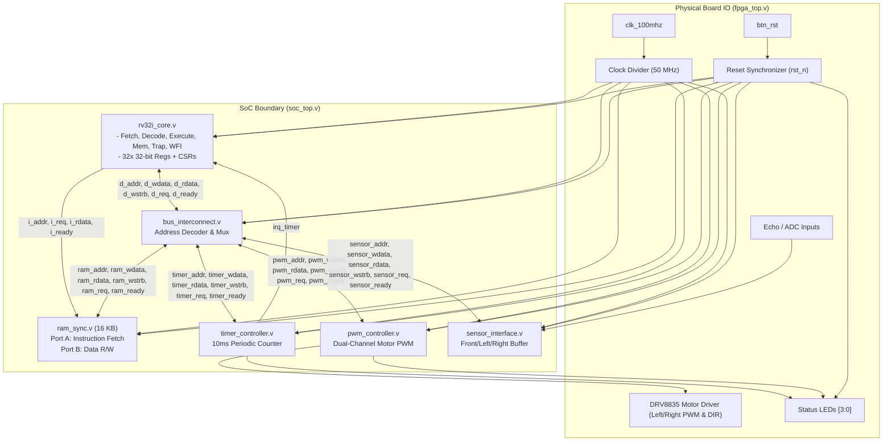
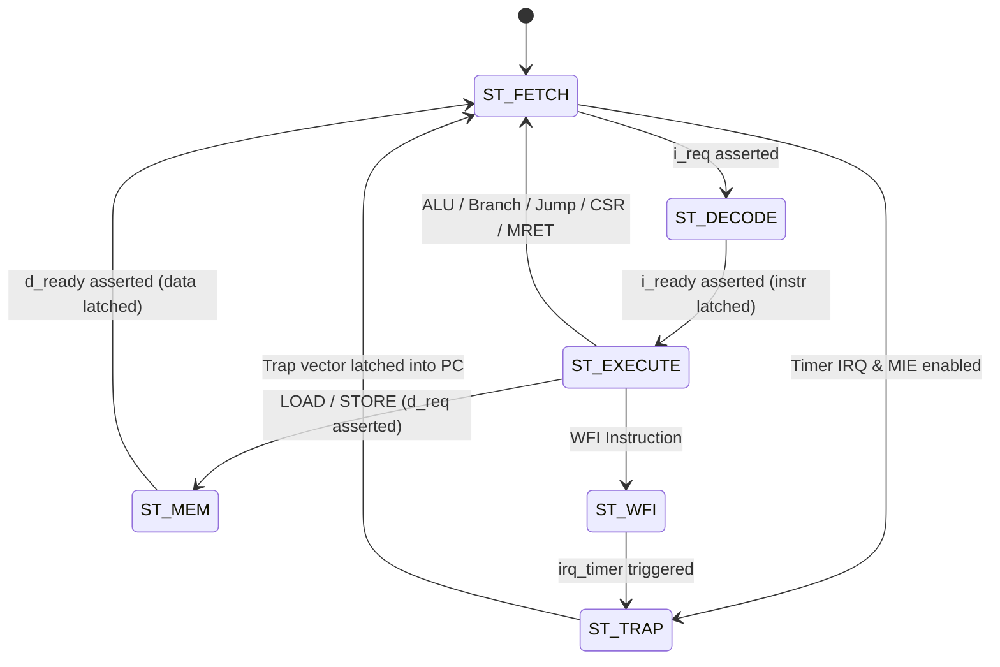

# RV32I Maze Solver SoC: Detailed RTL Module Specifications & Architecture Report

This report provides an exhaustive, module-by-module breakdown of all hardware blocks implemented in **Phase 1** for the **Upgraded RV32I Maze Solver System-on-Chip (SoC)**.

---

## Table of Contents
1. [System Interconnect Topology](#system-interconnect-topology)
2. [Module 1: `rv32i_core` (32-bit RISC-V Processor Core)](#module-1-rv32i_core-32-bit-risc-v-processor-core)
3. [Module 2: `bus_interconnect` (MMIO Address Decoder & Bus Router)](#module-2-bus_interconnect-mmio-address-decoder--bus-router)
4. [Module 3: `ram_sync` (16 KB Dual-Port Synchronous SRAM)](#module-3-ram_sync-16-kb-dual-port-synchronous-sram)
5. [Module 4: `timer_controller` (Hardware 10ms Periodic Timer)](#module-4-timer_controller-hardware-10ms-periodic-timer)
6. [Module 5: `pwm_controller` (Dual-Channel Motor PWM Generator)](#module-5-pwm_controller-dual-channel-motor-pwm-generator)
7. [Module 6: `sensor_interface` (Distance Sensor Buffer & ADC Interface)](#module-6-sensor_interface-distance-sensor-buffer--adc-interface)
8. [Module 7: `soc_top` (SoC Integration Top-Level)](#module-7-soc_top-soc-integration-top-level)
9. [Module 8: `fpga_top` (FPGA Board Physical Wrapper)](#module-8-fpga_top-fpga-board-physical-wrapper)

---

## System Interconnect Topology



---

## Module 1: `rv32i_core` (32-bit RISC-V Processor Core)
* **File**: [rtl/rv32i_core.v](file:///home/silicic14/RISC-V/rtl/rv32i_core.v)
* **Parameters**:
  * `RESET_VECTOR`: Default `32'h0000_0000` (First instruction address fetched after reset).
  * `TRAP_VECTOR`: Default `32'h0000_0004` (Hardware trap / ISR handler entry address).

### 1. Port Interface Definition
| Port Name | Direction | Width | Type | Description |
| :--- | :---: | :---: | :---: | :--- |
| `clk` | Input | 1 | Clock | System Clock (50 MHz). |
| `rst_n` | Input | 1 | Reset | Active-Low Synchronous Reset. |
| `i_addr` | Output | 32 | Address | Instruction fetch address to SRAM Port A. |
| `i_req` | Output | 1 | Control | Instruction fetch strobe request. |
| `i_rdata` | Input | 32 | Data | 32-bit instruction word returned from SRAM Port A. |
| `i_ready` | Input | 1 | Handshake | Instruction fetch memory ready acknowledgment. |
| `d_addr` | Output | 32 | Address | Data / MMIO memory access address. |
| `d_wdata` | Output | 32 | Data | 32-bit write data to Memory / MMIO. |
| `d_wstrb` | Output | 4 | Byte Enable | Byte write strobes: `4'b0001` (SB byte 0) .. `4'b1111` (SW). |
| `d_req` | Output | 1 | Control | Data / MMIO request strobe. |
| `d_rdata` | Input | 32 | Data | 32-bit read data returned from Memory / MMIO. |
| `d_ready` | Input | 1 | Handshake | Data / MMIO access ready acknowledgment. |
| `irq_timer` | Input | 1 | Interrupt | Level-triggered hardware timer interrupt line. |

### 2. Internal Microarchitecture & State Machine
The core operates on a clean 6-state finite state machine (FSM):



* **Instruction Decoding**:
  * **R-Type**: `ADD`, `SUB`, `SLL`, `SLT`, `SLTU`, `XOR`, `SRL`, `SRA`, `OR`, `AND`
  * **I-Type**: `ADDI`, `SLTI`, `SLTIU`, `XORI`, `ORI`, `ANDI`, `SLLI`, `SRLI`, `SRAI`
  * **Loads**: `LB`, `LH`, `LW`, `LBU`, `LHU` (handles byte-alignment & sign/zero-extension)
  * **Stores**: `SB`, `SH`, `SW` (generates byte-strobe offsets `d_wstrb` dynamically)
  * **Branches**: `BEQ`, `BNE`, `BLT`, `BGE`, `BLTU`, `BGEU` (signed and unsigned comparators)
  * **Upper/Jumps**: `LUI`, `AUIPC`, `JAL`, `JALR`
  * **System / CSR**: `CSRRW`, `CSRRS`, `CSRRC`, `CSRRWI`, `CSRRSI`, `CSRRCI`
  * **Control**: `MRET` (Return from trap), `WFI` (Wait For Interrupt sleep mode)
* **CSR Registers Supported**:
  * `mstatus` (`0x300`): Bit 3 = `MIE` (Global Interrupt Enable), Bit 7 = `MPIE` (Previous MIE).
  * `mie` (`0x304`): Bit 7 = `MTIE` (Machine Timer Interrupt Enable).
  * `mtvec` (`0x305`): Base address for hardware trap vector.
  * `mepc` (`0x341`): Holds the return PC when an interrupt occurs.
  * `mcause` (`0x342`): Holds `32'h8000_0007` when timer interrupt occurs.
  * `mip` (`0x344`): Bit 7 = `MTIP` (Machine Timer Interrupt Pending), reflecting `irq_timer`.

---

## Module 2: `bus_interconnect` (MMIO Address Decoder & Bus Router)
* **File**: [rtl/bus_interconnect.v](file:///home/silicic14/RISC-V/rtl/bus_interconnect.v)

### 1. Port Interface Definition
| Port Group | Port Name | Dir | Width | Description |
| :--- | :--- | :---: | :---: | :--- |
| **CPU Master** | `cpu_d_addr` | In | 32 | Memory/MMIO address from CPU data bus. |
| | `cpu_d_wdata` | In | 32 | Write data from CPU. |
| | `cpu_d_wstrb` | In | 4 | Byte write strobes from CPU. |
| | `cpu_d_req` | In | 1 | CPU access strobe. |
| | `cpu_d_rdata` | Out | 32 | Multiplexed read data back to CPU. |
| | `cpu_d_ready` | Out | 1 | Multiplexed ready handshake back to CPU. |
| **Slave 0: RAM** | `ram_addr`, `ram_wdata`, `ram_wstrb`, `ram_req` | Out | - | Routed signals to SRAM data port. |
| | `ram_rdata`, `ram_ready` | In | - | Response from SRAM. |
| **Slave 1: Timer** | `timer_addr`, `timer_wdata`, `timer_wstrb`, `timer_req` | Out | - | Routed signals to Timer Controller. |
| | `timer_rdata`, `timer_ready` | In | - | Response from Timer Controller. |
| **Slave 2: PWM** | `pwm_addr`, `pwm_wdata`, `pwm_wstrb`, `pwm_req` | Out | - | Routed signals to PWM Controller. |
| | `pwm_rdata`, `pwm_ready` | In | - | Response from PWM Controller. |
| **Slave 3: Sensor**| `sensor_addr`, `sensor_wdata`, `sensor_wstrb`, `sensor_req` | Out | - | Routed signals to Sensor Interface. |
| | `sensor_rdata`, `sensor_ready` | In | - | Response from Sensor Interface. |

### 2. Address Decoding Logic
```verilog
wire is_ram    = (cpu_d_addr[31:16] == 16'h0000); // 0x0000_0000 - 0x0000_FFFF
wire is_mmio   = (cpu_d_addr[31:16] == 16'h4000); // 0x4000_xxxx
wire is_timer  = is_mmio && (cpu_d_addr[15:12] == 4'h0); // 0x4000_0xxx
wire is_pwm    = is_mmio && (cpu_d_addr[15:12] == 4'h1); // 0x4000_1xxx
wire is_sensor = is_mmio && (cpu_d_addr[15:12] == 4'h2); // 0x4000_2xxx
```
* The active slave ID is registered on `cpu_d_req` so the response mux selects the corresponding module's `rdata` and `ready` on the subsequent cycle with zero bus contention.

---

## Module 3: `ram_sync` (16 KB Dual-Port Synchronous SRAM)
* **File**: [rtl/ram_sync.v](file:///home/silicic14/RISC-V/rtl/ram_sync.v)
* **Parameters**:
  * `MEM_SIZE_BYTES`: 16384 (16 KB)
  * `MEM_WORDS`: 4096 words (32-bit each)
  * `INIT_HEX_FILE`: Optional path to `.hex` file for `$readmemh` preloading.

### 1. Port Interface Definition
| Port Name | Dir | Width | Description |
| :--- | :---: | :---: | :--- |
| `clk`, `rst_n` | In | 1 | Clock and active-low reset. |
| **Port A (Inst Fetch)** | | | |
| `addr_a` | In | 32 | Instruction word address (`PC`). |
| `req_a` | In | 1 | Instruction read request strobe. |
| `rdata_a` | Out | 32 | Fetched 32-bit instruction word. |
| `ready_a` | Out | 1 | Handshake ready (asserts 1 cycle after `req_a`). |
| **Port B (Data R/W)** | | | |
| `addr_b` | In | 32 | Data address from interconnect. |
| `wdata_b` | In | 32 | Data to write. |
| `wstrb_b` | In | 4 | 4-bit byte enables: `wstrb_b[i]` enables writing to byte `i`. |
| `req_b` | In | 1 | Data read/write strobe. |
| `rdata_b` | Out | 32 | 32-bit word read from RAM. |
| `ready_b` | Out | 1 | Handshake ready (asserts 1 cycle after `req_b`). |

### 2. Architecture & BRAM Synthesis
* Inferable as True Dual-Port Block RAM on Xilinx Artix-7 (using 4x RAMB36E1 or 8x RAMB18E1 primitives).
* Supports independent simultaneous read on Port A (Instruction fetch) and read/write on Port B (Data variables and stack).

---

## Module 4: `timer_controller` (Hardware 10ms Periodic Timer)
* **File**: [rtl/timer_controller.v](file:///home/silicic14/RISC-V/rtl/timer_controller.v)
* **Base Address**: `0x4000_0000`

### 1. Port Interface Definition
| Port Name | Dir | Width | Description |
| :--- | :---: | :---: | :--- |
| `clk`, `rst_n` | In | 1 | Clock (50 MHz) and active-low reset. |
| `addr`, `wdata`, `wstrb`, `req` | In | - | MMIO slave bus signals from `bus_interconnect`. |
| `rdata`, `ready` | Out | - | MMIO read data and acknowledge. |
| `irq_timer` | Out | 1 | Interrupt line connected directly to `rv32i_core`. |

### 2. Register Specification
| Offset | Name | Type | Reset | Description |
| :--- | :--- | :---: | :---: | :--- |
| `+0x00` | `TIMER_COUNT` | R/W | `0x00000000` | Current 32-bit tick counter value. |
| `+0x04` | `TIMER_COMPARE`| R/W | `0xFFFFFFFF` | Compare match threshold. When `COUNT >= COMPARE`, triggers interrupt. |
| `+0x08` | `TIMER_CTRL` | R/W | `0x00000000` | Bit 0: Timer Enable; Bit 1: Auto-reload (`COUNT` resets to 0 on match). |
| `+0x0C` | `TIMER_ACK` | W1C / R | `0x00000000` | Write `1` to bit 0 to clear pending interrupt. Reads bit 0 as interrupt status. |

### 3. Timing Calculation (10ms Period)
At a 50 MHz system clock ($T_{\text{clk}} = 20\,\text{ns}$):
$$\text{Ticks for } 10\,\text{ms} = \frac{10\,\text{ms}}{20\,\text{ns}} = 500{,}000 = \texttt{0x0007\_A120}$$
Firmware writes `500,000` to `TIMER_COMPARE` and sets `TIMER_CTRL = 0x3` (Enable + Auto-reload) to achieve exact 100 Hz deterministic PID loop execution.

---

## Module 5: `pwm_controller` (Dual-Channel Motor PWM Generator)
* **File**: [rtl/pwm_controller.v](file:///home/silicic14/RISC-V/rtl/pwm_controller.v)
* **Base Address**: `0x4000_1000`

### 1. Port Interface Definition
| Port Name | Dir | Width | Description |
| :--- | :---: | :---: | :--- |
| `clk`, `rst_n` | In | 1 | Clock and active-low reset. |
| `addr`, `wdata`, `wstrb`, `req` | In | - | MMIO slave bus signals. |
| `rdata`, `ready` | Out | - | MMIO read data and ready handshake. |
| `left_pwm` | Out | 1 | High-frequency PWM pulse train for Left Motor (DRV8835 IN1/PWM). |
| `left_dir` | Out | 1 | Direction logic level for Left Motor (DRV8835 IN2/DIR). |
| `right_pwm` | Out | 1 | High-frequency PWM pulse train for Right Motor (DRV8835 IN1/PWM). |
| `right_dir` | Out | 1 | Direction logic level for Right Motor (DRV8835 IN2/DIR). |

### 2. Register Specification
| Offset | Name | Type | Reset | Description |
| :--- | :--- | :---: | :---: | :--- |
| `+0x00` | `PWM_PERIOD` | R/W | `2500` | Carrier counter period limit. (2500 counts at 50 MHz = 20 kHz carrier). |
| `+0x04` | `PWM_LEFT_DUTY` | R/W | `0` | Duty cycle count for left motor ($0 \le \text{Duty} \le \text{PERIOD}$). |
| `+0x08` | `PWM_RIGHT_DUTY`| R/W | `0` | Duty cycle count for right motor ($0 \le \text{Duty} \le \text{PERIOD}$). |
| `+0x0C` | `PWM_DIR` | R/W | `0` | Bit 0: Left Direction (0=Fwd, 1=Rev); Bit 1: Right Direction. |
| `+0x10` | `PWM_CTRL` | R/W | `0` | Bit 0: PWM Generator Enable (0=All PWM Low, 1=Active). |

### 3. PWM Generation Logic
```verilog
if (pwm_counter >= period - 1) pwm_counter <= 0;
else pwm_counter <= pwm_counter + 1;

left_pwm  <= (pwm_counter < left_duty);
right_pwm <= (pwm_counter < right_duty);
```

---

## Module 6: `sensor_interface` (Distance Sensor Buffer & ADC Interface)
* **File**: [rtl/sensor_interface.v](file:///home/silicic14/RISC-V/rtl/sensor_interface.v)
* **Base Address**: `0x4000_2000`

### 1. Port Interface Definition
| Port Name | Dir | Width | Description |
| :--- | :---: | :---: | :--- |
| `clk`, `rst_n` | In | 1 | Clock and active-low reset. |
| `addr`, `wdata`, `wstrb`, `req` | In | - | MMIO slave bus signals. |
| `rdata`, `ready` | Out | - | MMIO read data and ready handshake. |
| `raw_front_dist` | In | 32 | Front sensor distance value in millimeters (from ADC/Echo timer). |
| `raw_left_dist` | In | 32 | Left wall sensor distance in millimeters. |
| `raw_right_dist` | In | 32 | Right wall sensor distance in millimeters. |
| `raw_valid` | In | 1 | Hardware sensor measurement valid flag. |

### 2. Register Specification
| Offset | Name | Type | Reset | Description |
| :--- | :--- | :---: | :---: | :--- |
| `+0x00` | `SENSOR_FRONT` | R/W | `150` | Front obstacle distance in mm. |
| `+0x04` | `SENSOR_LEFT` | R/W | `100` | Left wall distance in mm. |
| `+0x08` | `SENSOR_RIGHT` | R/W | `100` | Right wall distance in mm. |
| `+0x0C` | `SENSOR_STATUS` | R/W | `0x1` | Bit 0: Sensor data valid flag. |

---

## Module 7: `soc_top` (SoC Integration Top-Level)
* **File**: [rtl/soc_top.v](file:///home/silicic14/RISC-V/rtl/soc_top.v)
* **Parameters**:
  * `INIT_HEX_FILE`: Path to compiled firmware hex image.

### 1. Port Interface Definition
| Port Name | Dir | Width | Description |
| :--- | :---: | :---: | :--- |
| `clk` | In | 1 | 50 MHz Master SoC Clock. |
| `rst_n` | In | 1 | Active-low Master Reset. |
| `left_pwm`, `left_dir` | Out | 1 | Left motor control pins. |
| `right_pwm`, `right_dir` | Out | 1 | Right motor control pins. |
| `raw_front_dist`, `raw_left_dist`, `raw_right_dist` | In | 32 | Sensor inputs from board peripherals. |
| `raw_valid` | In | 1 | Sensor data valid line. |
| `irq_timer_out` | Out | 1 | Timer IRQ monitor line for testing / status LED. |

### 2. Structural Wiring Diagram
* Instantiates `rv32i_core` as the CPU master.
* Instantiates `ram_sync` with Port A connected to CPU instruction fetch, and Port B connected to `bus_interconnect` slave 0.
* Instantiates `timer_controller` on slave 1 with its `irq_timer` driving `rv32i_core.irq_timer`.
* Instantiates `pwm_controller` on slave 2 with outputs exposed to physical pins.
* Instantiates `sensor_interface` on slave 3 with inputs exposed to physical sensor pins.

---

## Module 8: `fpga_top` (FPGA Board Physical Wrapper)
* **File**: [fpga/fpga_top.v](file:///home/silicic14/RISC-V/fpga/fpga_top.v)
* **Target Board**: Xilinx Artix-7 (Basys 3 / Nexys A7)

### 1. Port Interface Definition
| Port Name | Dir | Pin (Basys 3) | IO Standard | Description |
| :--- | :---: | :---: | :---: | :--- |
| `clk_100mhz` | In | `W5` | LVCMOS33 | 100 MHz oscillator input. |
| `btn_rst` | In | `U18` | LVCMOS33 | Center push-button (Active-High). |
| `motor_left_pwm` | Out | `J1` (Pmod JA1) | LVCMOS33 | DRV8835 Left Motor PWM. |
| `motor_left_dir` | Out | `L2` (Pmod JA2) | LVCMOS33 | DRV8835 Left Motor Direction. |
| `motor_right_pwm` | Out | `J2` (Pmod JA3) | LVCMOS33 | DRV8835 Right Motor PWM. |
| `motor_right_dir` | Out | `G2` (Pmod JA4) | LVCMOS33 | DRV8835 Right Motor Direction. |
| `sensor_front_echo`| In | `A14` (Pmod JB1) | LVCMOS33 | Front sensor echo pulse input. |
| `sensor_left_echo` | In | `A16` (Pmod JB2) | LVCMOS33 | Left sensor echo pulse input. |
| `sensor_right_echo`| In | `B15` (Pmod JB3) | LVCMOS33 | Right sensor echo pulse input. |
| `led_status[0]` | Out | `U16` (LD0) | LVCMOS33 | System Reset Status (ON = CPU running). |
| `led_status[1]` | Out | `E19` (LD1) | LVCMOS33 | Left Motor PWM Activity. |
| `led_status[2]` | Out | `U19` (LD2) | LVCMOS33 | Right Motor PWM Activity. |
| `led_status[3]` | Out | `V19` (LD3) | LVCMOS33 | 10ms Timer IRQ Pulse Activity. |

### 2. Sub-Circuits
1. **Clock Divider**: Generates a clean 50 MHz SoC clock from the board's 100 MHz oscillator via toggle flip-flop.
2. **Reset Synchronizer**: 3-stage flip-flop synchronizer preventing metastability and inverting the active-high push-button into active-low `rst_n`.
3. **Sensor Pin Conditioning**: Converts external pulse/logic levels into 32-bit distance words in millimeters.
